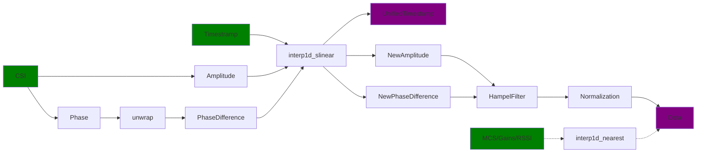
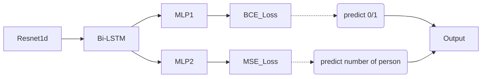

# Wi-Fi感知大赛——办公场景
> Case 1：连续开放会议室的多目标存在检测、定位；
> Case 2：连续小会议室的多目标存在检测；

## Dataset
训练集：场景1:10月16日发布的训练数据。场景2:10月20日发布的训练数据。验证集：同上，因此是封闭域训练。

数据集放置在`/data`路径下。格式：

-  data
    - 1016
        - train
            - signal
                - 0_1_1.txt
                - 0_1_2.txt
                - ...
            - gt
                - 0_1_1.txt
                - 0_1_2.txt
                - ...
        - test
            - signal
            - gt
    - 1020
        - ...

`0_1_2.txt`表示房间0、AP1、场景2。您也可以按照自己的方式命名，但确保signal和gt文件名称相同。
## Data Preprocessing

<!-- ```mermaid
graph LR;
    MCS/Gains/RSSI -.-> interp1d_[interp1d_nearest];
    interp1d_ -.-> Data;
``` -->
## Model


## Result
`/run/`：存放训练模型。<br>
`/results/`：存放模型预测结果，即比赛提交的文件。<br>
`/overviews/`：可视化测试集信号与预测结果。<br>

## Config
训练参数见`/config/*.yaml`。由于该任务模型相对简单、稳定，模型超参数见`/model/net.py`。

## Usage
```bash
cd ./wifi_localization
```
### train
创建参数文件`xxx.yaml`，并设置参数。修改`train.sh`中的显卡编号、通信端口、和配置文件。运行：
```bash
sh train.sh
```
本工程采用Pytorch DDP，实际训练算力并不需要消耗多卡，只需设置一块显卡即可。

### inference
用于生成测试数据的预测结果文件。设置`inference.py`中的配置文件路径`xxx.yaml`，运行：
```bash
python inference.py
```
**由于赛题需要，`inference.py`中的`from dataset.wifi2 import WiFi`仅为保证两个场景的运行结果与提交结果一致而分开定义。**<p style="color: red;">事实上，`wifi2`是落后于`wifi`的版本，已被弃用。</p>

### overview
用于生成可视化测试集信号与预测结果。设置`overview.py`中的`TASK`和`预测文件路径`，运行：
```bash
python overview.py
```

## Contact
If you have any question or suggestion related to this project, feel free to open an issue or pull a request. You also can email Minjun Lu(luminjun@shu.edu.cn)

## Links
1. 赛题介绍：[第一届Wi-Fi感知大赛](https://competition.huaweicloud.com/information/1000041958/circumstance)    -举办方：华为技术有限公司 
2. Case 1 数据集：[Room0](https://res-static.hc-cdn.cn/cloudbu-site/china/zh-cn/WiFi_sensing/wifi%20sensing%20contest%201016/1697437846576614303.zip),[Room1](https://res-static.hc-cdn.cn/cloudbu-site/china/zh-cn/WiFi_sensing/wifi%20sensing%20contest%201016/1697438036600130255.zip),[Room2](https://res-static.hc-cdn.cn/cloudbu-site/china/zh-cn/WiFi_sensing/wifi%20sensing%20contest%201016/1697438259272695377.zip),[Room3](https://res-static.hc-cdn.cn/cloudbu-site/china/zh-cn/WiFi_sensing/wifi%20sensing%20contest%201016/1697438338117517614.zip)
3. Case 2 数据集：[Room0-AP右](https://res-static.hc-cdn.cn/cloudbu-site/china/zh-cn/WiFi_sensing/wifi%20sensing%20contest%201020/1697765533864672087.zip),[Room1-AP中](https://res-static.hc-cdn.cn/cloudbu-site/china/zh-cn/WiFi_sensing/wifi%20sensing%20contest%201020/1697765620023356359.zip),[Room2-AP左](https://res-static.hc-cdn.cn/cloudbu-site/china/zh-cn/WiFi_sensing/wifi%20sensing%20contest%201020/1697765709268131102.zip)
