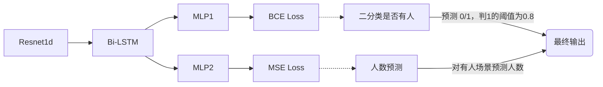

# Wi-Fi感知大赛
## 赛道1：检测，定位——办公场景

### Dataset
训练集：场景1:10月16日发布的训练数据。场景2:10月20日发布的训练数据。

验证集：同上，因此是封闭域训练。

### Model

### Result
见`/predict/`目录，每日更新。

### Config
训练参数见`/config/config.yaml`。由于该任务模型相对简单、稳定，模型参数直接写死在代码里了，见`/model/net.py`。

<!-- ### Usage
下周代码稳定了再说 -->